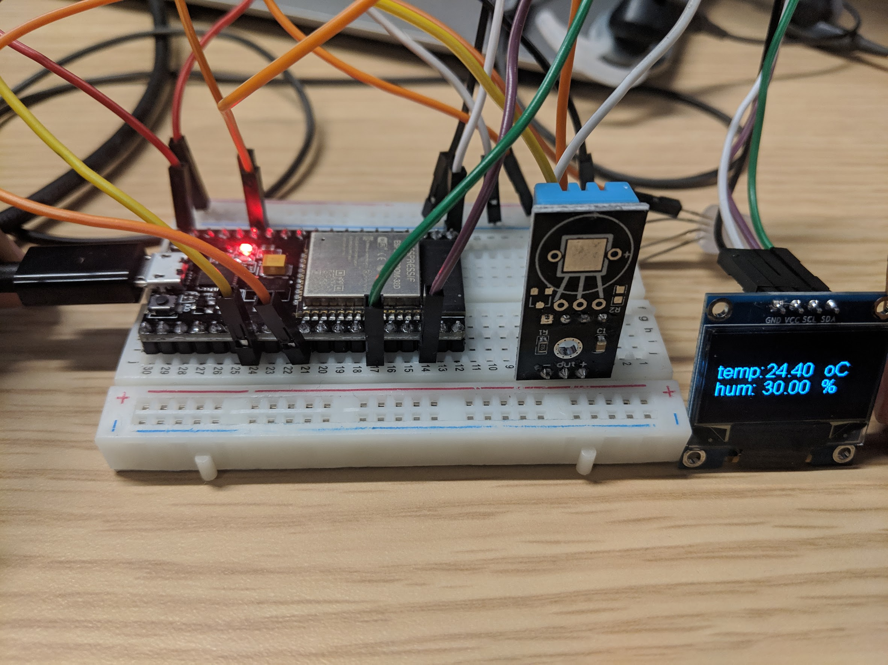

*Quick links :*
[Home](/README.md) - [Part 1](../part1/README.md) - [Part 2](../part2/README.md) - [Part 3](../part3/README.md)  - [**Sensors**](/en/sensors/README.md)

***
**Sensor labs: ** [Sensor](README.md) - [Ultrasonic Sensor](ESP32-CAM+Neopixel-LED+HC-SR04.md) - [Pyroelectric Infrared PIR Sensor](ESP32-CAM+Neopixel-LED+PIR.md) - [**OLED LCD Display Module**](ESP32-CAM+SSD1306_Display.md) - [GY-291 ADXL345 Gravity Tilt Module](ESP32-CAM+GY-291_ADXL345_Gyroscope.md)
***

This part contains instruction to get started with 0.96 i2C OLED LCD LED Display Module for Arduino
 on ESP32S

## Lab Objectives

In this lab you will learn how to connect the OLED LCD LED Display Module to the ESP32S board and how to display text/images on the display.

You will learn:

- The electrical connections needed to connect the Display Module  to the ESP32S
- Run a simple application to read temperature data from the DHT11 and display it using the Display Module 
- The useful library used to build more advanced applications 

Parts in this lab:

- ESP32S (36 pins)
- 0.96" I2C IIC Serial 128X64 128*64 Blue OLED LCD LED Display Module for Arduino
- DHT 11 
- male-male Jumpers
- male-female Jumpers

### Step 1 - Wire the parts together

First you need to wire the part together on a breadboard. Here is the diagram of the example


GPIO 21 and GPIO 22 are used to connect the display module to the ESP32S. SDA pin(green) connects to GPIO 21 and SCL(purple) connects to GPIO 22. Be careful not to change these.

### Step 2 - Download neccessary libraries

Search for and download the ESP8266_and_ESP32_Oled_Driver_for_SSD1306_display library through the Manage libraries option in the Arduino IDE

### Step 2 - Input the application code

I've provided the code for the application below. The code is pretty simple with detailed explanation in the form of comments. You can copy and paste into to a new sketch on your Arduino IDE then compile and run it.


```C++
#include <Wire.h>  // Only needed for Arduino 1.6.5 and earlier
#include "SSD1306Wire.h" // legacy include: `#include "SSD1306.h"`
#include "DHT.h"
#define DHTPIN 4
#define SDAPIN 21
#define SCLPIN 22
#define DHTTYPE DHT11
float localHum = 0;
float localTemp = 0;

SSD1306Wire  display(0x3c, SDAPIN, SCLPIN);
DHT dht(DHTPIN, DHTTYPE);


void setup() {
  Serial.begin(115200);
  Serial.println();
  dht.begin();
  display.init();
  display.flipScreenVertically();
  display.setFont(ArialMT_Plain_10); //Other fonts available : ArialMT_Plain_16; ArialMT_Plain_24; Or to generate custom fonts: http://oleddisplay.squix.ch/
}

void loop()
{
  getDHT();
  displayData();
  delay(2000);
}

void displayData()
{
  display.clear();   // clear the display
  display.drawString(0, 16,  "temp: ");
  display.drawString(40, 16,  String(localTemp));
  display.drawString(90, 0,  "oC");
  display.drawString(0, 32, "hum:  ");
  display.drawString(40, 32,  String(localHum));
  display.drawString(90, 32,  "%");
  display.display();   // write the buffer to the display
  delay(10);
}

void getDHT()
{
  float tempIni = localTemp;
  float humIni = localHum;
  localTemp = dht.readTemperature();
  localHum = dht.readHumidity();
  if (isnan(localHum) || isnan(localTemp))   // Check if any reads failed and exit early (to try again).
  {
    localTemp = tempIni;
    localHum = humIni;
    return;
  }
}

```

### Step 3 - Run the code and view output

Save, compile and upload the sketch.  Once uploaded open up the Serial Monitor and set the baud rate to 115200, to match the rate set in the Serial.begin(115200) message. 

You can see the temperature and humidity displayed on the Display Module




### Step 4 - Load library and examples

To see how to use the Display Module in more advanced ways, there are some useful sketch examples that you can load into your IDE. You can load an example from *File* -> *Examples* -> *ESP8266_and_ESP32_Oled_Driver_for_SSD1306_display* and select from the list.

***
**Sensor labs: ** [Sensor](README.md) - [Ultrasonic Sensor](ESP32-CAM+Neopixel-LED+HC-SR04.md) - [Pyroelectric Infrared PIR Sensor](ESP32-CAM+Neopixel-LED+PIR.md) - [**OLED LCD Display Module**](ESP32-CAM+SSD1306_Display.md) - [GY-291 ADXL345 Gravity Tilt Module](ESP32-CAM+GY-291_ADXL345_Gyroscope.md)
***
*Quick links :*
[Home](/README.md) - [Part 1](../part1/README.md) - [Part 2](../part2/README.md) - [Part 3](../part3/README.md) - - [Sensors](/en/sensors/README.md)