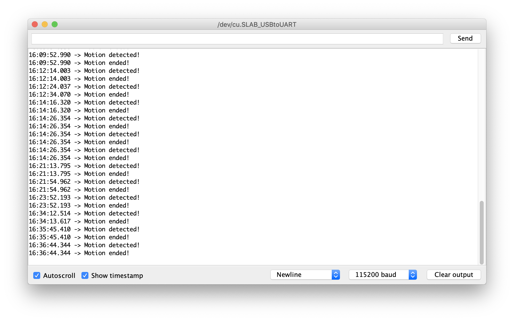

*Quick links :*
[Home](/README.md) - [Part 1](../part1/README.md) - [Part 2](../part2/README.md) - [Part 3](../part3/README.md)  - [**Sensors**](/en/sensors/README.md)

***
**Sensor labs: ** [Sensor](README.md) - [Ultrasonic Sensor](ESP32S+Neopixel-LED+HC-SR04.md) - [**Pyroelectric Infrared PIR Sensor**](ESP32S+Neopixel-LED+PIR.md) - [Heart sensor](PULSE+RGB.md) - [OLED LCD Display Module](SSD1306_Display.md) - [GY-291 ADXL345 Gravity Tilt Module](GY-291_ADXL345_Gyroscope.md) 
<!-- - [Whopper Sensors](ESP32S+Pulse+Neopixel-LED+Ultrasonic+DHT11+Display.md)  -->
***

This part contains instruction to get started with Pyroelectric Infrared PIR sensor on ESP32S

## Lab Objectives

In this lab you will learn how to connect the Pyroelectric Infrared PIR sensor to the ESP32S board and how to access data from the sensor, then take actions based on the data returned.

You will learn:

- The electrical connections needed to connect the Pyroelectric Infrared PIR sensor to the ESP32S
- Run a simple application to read data from the sensor and change color of a Neo Pixel RGB
- The useful library used to build more advanced application using the sensor

Parts in this lab:

- ESP32S (36 pins)
- HC-SR501 Pyroelectric Infrared PIR Sensor
- Neo Pixel 8mm 
- male-male Jumpers
- male-female Jumpers

### Step 1 - Wire the parts together

First you need to wire the part together on a breadboard. Here is the diagram of the example


GPIO 5 is used to control the LED colors. Data pin (blue) of the Pyroelectric Infrared PIR sensor is connected to analog pin GPIO 21.

### Step 2 - Input the application code

I've provided the code for the application below. The code is pretty simple with detailed explanation in the form of comments. You can copy and paste into to a new sketch on your Arduino IDE then compile and run it.


```C++
/* This code is to read raw distance signal from a Pyroelectric Infrared PIR sensor and change the 
 *  color or a Neo Pixel RGB accordinly to a pre-defined conditions.
 */
 
#include <Adafruit_NeoPixel.h>
#define NEOPIXEL_TYPE NEO_RGB + NEO_KHZ800
#define RGB_PIN 5 // GPIO pin the data line of RGB LED is connected to

Adafruit_NeoPixel pixel = Adafruit_NeoPixel(1, RGB_PIN, NEOPIXEL_TYPE);

int inputPin = 21;               // choose the input pin (for PIR sensor)
int pirState = LOW;             // we start, assuming no motion detected
int val = 0;                    // variable for reading the pin status
 
void setup() {
  pinMode(inputPin, INPUT);     // declare sensor as input
  Serial.begin(115200);
  pixel.begin();
}
 
void loop(){
  val = digitalRead(inputPin);  // read input value
  if (val == HIGH) {
    
    // check if the input is HIGH
    pixel.setPixelColor(0, 0, 255, 0); // SET COLORS
    pixel.show(); // SHOW LED COLOR
    if (pirState == LOW) {
      // we have just turned on
      Serial.println("Motion detected!");
      // We only want to print on the output change, not state
      pirState = HIGH;
      delay(1000);
    }
  } else {
    pixel.setPixelColor(0, 255, 0, 0); // SET COLORS
    pixel.show(); // SHOW LED COLOR
    if (pirState == HIGH){
      // we have just turned of
      Serial.println("Motion ended!");
      // We only want to print on the output change, not state
      pirState = LOW;
    }
  }
}
```

### Step 3 - Run the code and view output using the Serial Monitor, Serial Plotter

Save, compile and upload the sketch.  Once uploaded open up the Serial Monitor and set the baud rate to 115200, to match the rate set in the Serial.begin(115200) message.  You should see some basic output showing the raw motion value read from the Pyroelectric Infrared PIR sensor as well as the RGB values corresponding to each motion value returned.  

The LED should be set to a colour based on the motion value.

- GREEN: Motion detected
- RED: No motion detected or stopped detecting motion

You can see the graphical view of the pulse output by opening the Serial Plottter view (Remember to close the Serial Monitor view first): Tool >> Serial Plotter



***
**Sensor labs: ** [Sensor](README.md) - [Ultrasonic Sensor](ESP32S+Neopixel-LED+HC-SR04.md) - [**Pyroelectric Infrared PIR Sensor**](ESP32S+Neopixel-LED+PIR.md) - [Heart sensor](PULSE+RGB.md) - [OLED LCD Display Module](SSD1306_Display.md) - [GY-291 ADXL345 Gravity Tilt Module](GY-291_ADXL345_Gyroscope.md) 
<!-- - [Whopper Sensors](ESP32S+Pulse+Neopixel-LED+Ultrasonic+DHT11+Display.md)  -->
***
*Quick links :*
[Home](/README.md) - [Part 1](../part1/README.md) - [Part 2](../part2/README.md) - [Part 3](../part3/README.md) - [Sensors](/en/sensors/README.md)